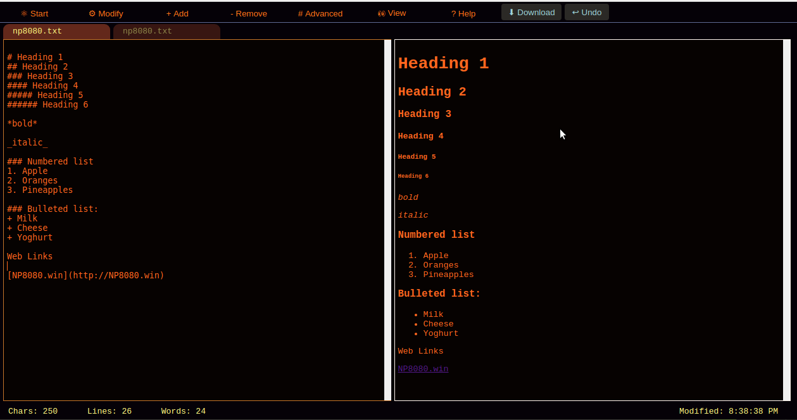

# np8080 0.0.24
24th July 2017

NP8080 is a simple notepad type app for the web with some text processing features.
It is lightweight and fast to load. 100% functionality when offline so great for Chromebooks.
 
 
 
I use it daily as a scratchpad, a markdown editor and for notes. Particularly handy when working in the context of a web browser
as switching tabs is far smoother than switching applications.

You can [try it out here](https://daftspaniel.github.io/demos/np8080/). 

Feature requests, bug reports and pull requests welcome!

## Development Details

NP8080 is written in [Angular Dart](https://webdev.dartlang.org/angular/) and can be
hosted on any web server as it is client-side. Find out more about [Dart](https://www.dartlang.org/). 

Run tests with (note tests mostly moved to sub-packages):
+ pub run test test/textprocess_tests.dart -p dartium

Run in development with:
+ pub serve

Build for deployment with:
+ pub build --mode=release --output=build

Check source code formatting:
+ dartfmt -n .
